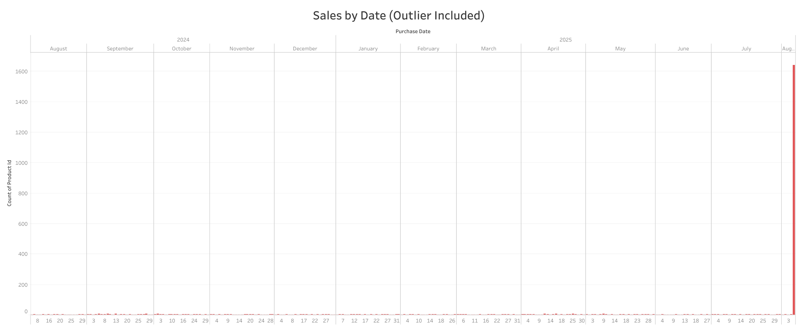
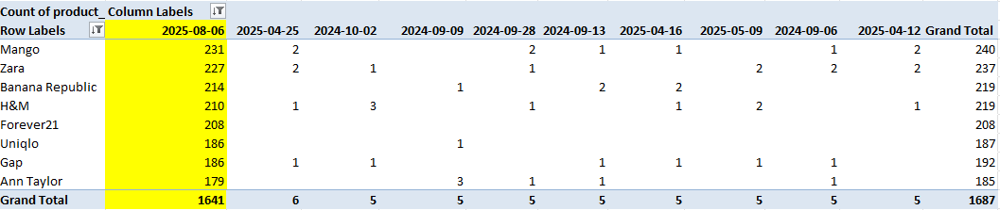
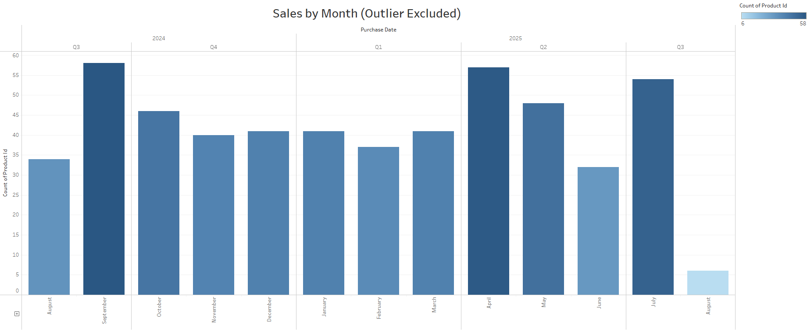
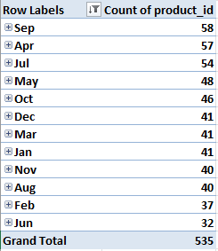
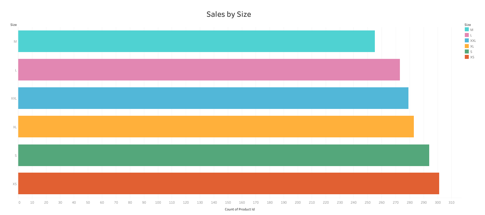
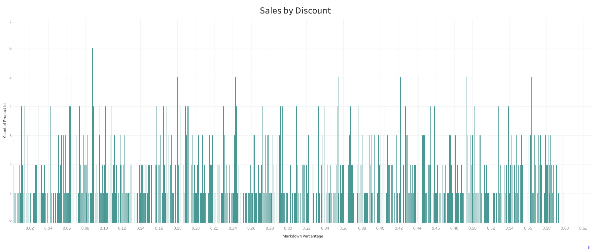
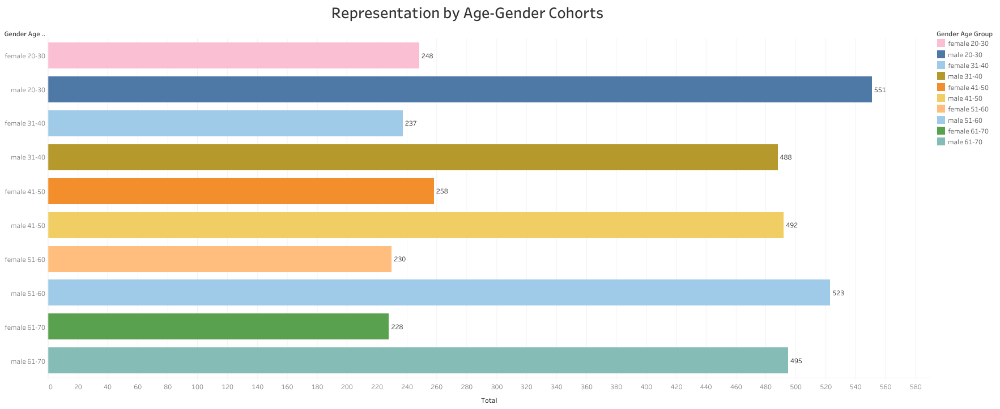
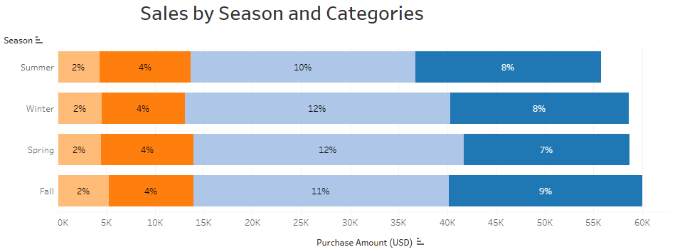

# Data Portfolio | Joyce Kwok

## Case Study: Clothing Retail Data Analysis

## Introduction
Analyzed two clothing retail datasets to identify trends in product sales and seasonal demand.

## The Problem Statement
Poppy is considering starting her own boutique but is uncertain about how seasons impact sales throughout the year. She is interested in how data-driven insights can help start her business.

## Solution
To address this, I analyzed clothing retail data to understand how seasons influence demand for clothing products. Based on the findings, I will make recommendations to help Poppy guide decisions around inventory planning, marketing, and pricing strategies for her new boutique.

## Hypothesis

The transition seasons of Fall and Spring have the highest overall sales compared to Summer and Winter.

## Data
[Dataset 1: Retail Fashion Boutique Data Sales Analytics 2025](fashion_boutique_dataset.xlsx)
- A synthetic fashion retail dataset containing 2,176 real-world style records spanning seasonal collections, customer purchasing behavior, pricing strategies, and return analytics

[Dataset 2: Consumer Behavior and Shopping Habits Dataset](shopping_behavior_updated_supplemental.xlsx)
- A synthetic dataset containing approximately 3900 records providing insights into consumers' preferences, tendencies, and patterns during their shopping experiences
   
Tools: Excel, SQL, Tableau

## Process
1. Cleaned the data and created pivot tables in Excel.
- Checked for duplicates
- Formatted data types
- Converted the markdown percentage from decimal to percentage
- Checked for misspellings using the filter function
- <u>Found and excluded a purchase date related outlier</u>
  
2. Cleaned and structured the data in SQL.
- Changed all column names delimited by spaces to be delimited by underscores
  
```
ALTER TABLE shopping_trends
RENAME COLUMN `Customer ID` TO customer_id
```

- Used "DISTINCT" queries on text-based columns to make sure there were no misspellings

```
SELECT DISTINCT age
FROM shopping_trends
```

- Checked each column for null values

```
SELECT *
FROM shopping_trends
WHERE customer_id IS NULL
```

- Validated the data (particularly purchase amounts, purchase dates, and customer ages)
  
```
SELECT purchase_amount
FROM shopping_trends
WHERE purchase_amount < 0

SELECT age
FROM shopping_trends
WHERE age > 120
```

## SQL Analysis

### Which season had the highest sales overall?

```
SELECT SUM(purchase_amount)
FROM shopping_trends
WHERE season = ‘winter’

SELECT SUM(purchase_amount)
FROM shopping_trends
WHERE season = ‘spring’

SELECT SUM(purchase_amount)
FROM shopping_trends
WHERE season = ‘fall’

SELECT SUM(purchase_amount)
FROM shopping_trends
WHERE season = ‘summer’
```

### Which category had the highest sales in which seasons?

```
SELECT
category,
    season,
    COUNT(*) AS total_purchases
FROM shopping_trends
GROUP BY category, season
```

### Which colours were most popular overall?

```
SELECT colour, COUNT(*)
FROM shopping_trends
GROUP BY colour
```

### Which age/gender cohort are the most/least represented in the dataset?

```
SELECT
    CASE 
        WHEN age >= 20 AND age <= 30 AND gender = 'female' THEN 'female 20-30'
        WHEN age >= 20 AND age <= 30 AND gender = 'male' THEN 'male 20-30'
        WHEN age >= 31 AND age <= 40 AND gender = 'female' THEN 'female 31-40'
        WHEN age >= 31 AND age <= 40 AND gender = 'male' THEN 'male 31-40'
        WHEN age >= 41 AND age <= 50 AND gender = 'female' THEN 'female 41-50'
        WHEN age >= 41 AND age <= 50 AND gender = 'male' THEN 'male 41-50'
        WHEN age >= 51 AND age <= 60 AND gender = 'female' THEN 'female 51-60'
        WHEN age >= 51 AND age <= 60 AND gender = 'male' THEN 'male 51-60'
        WHEN age >= 61 AND age <= 70 AND gender = 'female' THEN 'female 61-70'
        WHEN age >= 61 AND age <= 70 AND gender = 'male' THEN 'male 61-70'
    END AS gender_age_group,
    COUNT(*) AS total
FROM shopping_trends
GROUP BY gender_age_group
ORDER BY total DESC
```

## Analysis & Visualizations
### Sales by Date - Outlier Included
[](images/SalesbyDateOutlier.PNG)

[](images/PTTopPurchaseDates.PNG)


### Sales by Month - Outlier Excluded
[](images/SalesbyMonth.PNG)

[](images/PTTopMonths.PNG)


### Sales by Size
[](images/SalesbySize.PNG)


### Sales by Discount
[](images/SalesbyDiscount.PNG)


### Representation by Age/Gender Cohorts
[](images/RepbyAgeGenderCohorts.PNG)


### Sales by Season and Category
[](images/SalesbySeasonCategory.PNG)

## External Research
1. [Statistics Canada Article](https://www.statcan.gc.ca/o1/en/plus/5241-its-second-most-wonderful-time-year-canadian-retailers)
- Best
Holiday Season (particularly December) did the best in retail
Spring season (particularly May) did the best overall in clothing retail
- Worst
January & February as people spend less after holiday season and impact of weather

2. [Confiz Article](https://www.confiz.com/blog/best-and-worst-months-for-retail-sales/)
- Best:
Holiday season (particularly November and December)
Back to school season (particularly August and September)
Spring season (particularly March and Spring)
- Worst:
January & February due to post-holiday spending and winter lull
July due to summer slump, people going on vacation

## Conclusion

Overall, my hypothesis had some merit but it did not take into account how impactful the month of December is for sales. That said, the external research confirms that the peak of Winter (January and February) and peak of Summer (July) slow down in sales.

## Recommendations

Inventory Planning
- Stock up on inventory before peak seasons to meet the high demand, particularly August & September for back to school and November to December for the holidays

Marketing
- Utilize email marketing, loyalty programs and social media to maintain engagement and attract traffic during low seasons

Pricing
- Offer strategic discounts immediately post-season to attract bargain shoppers and help clear out older stock
- Offer bundle or limited-time discounts during slower seasons to incentivize purchases
